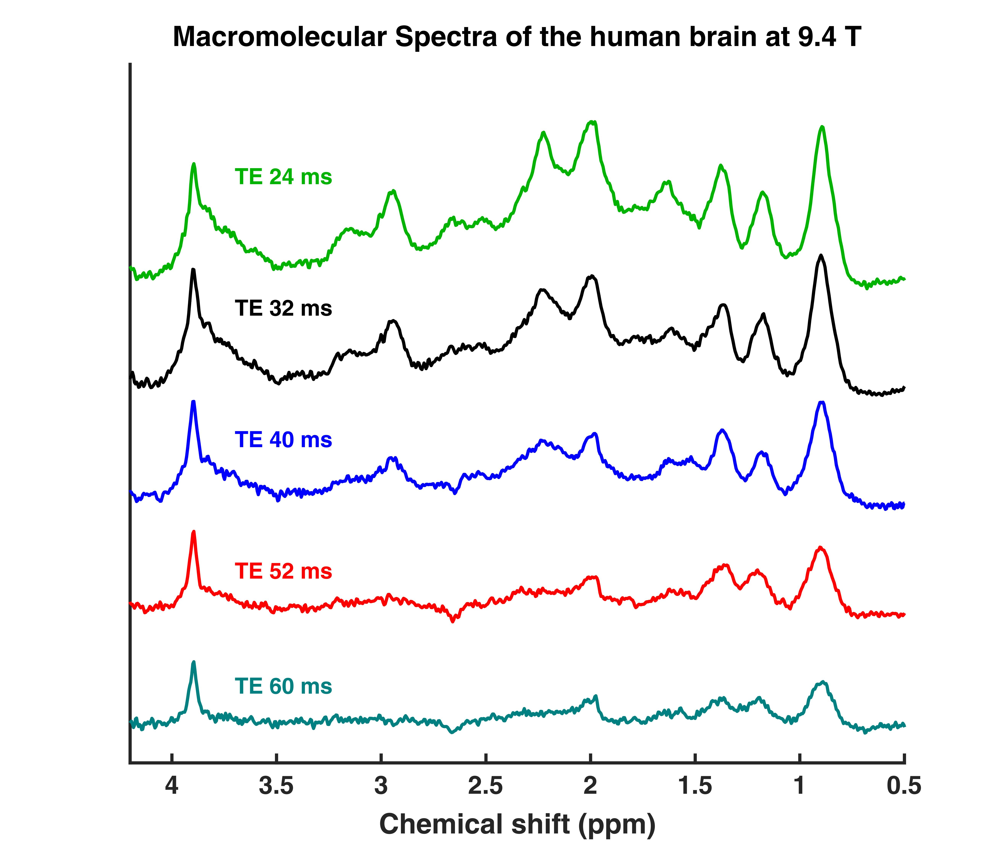

# MM 9.4T TE series and fit settings

# Concerning the data:

* It is from the following publication:
Murali‐Manohar S, Borbath T, Wright AM, Soher B, Mekle R, Henning A. T2 relaxation times of macromolecules and metabolites in the human brain at 9.4 T. Magnetic resonance in medicine. 2020;84:542–58.
* Sequence: DIR semi-LASER
* Voxel location: GM rich occipital lobe and WM rich occipital lobe
* TE: 24 ms, TR: 10 s, NEX: 32; Transmit reference frequency: 2.4 ppm, TInv1: 2360 ms, TInv2: 625 ms, Bandwidth: 8 kHz, Scan Frequency: 399.7182 MHz (9.4T)
* Spectrum summed from 11 healthy volunteers, no apodization/ filtering.
* Cr CH2 singlet removed through LCModel fitting for the data in the “Macromolecular baselines without Cr peak” folder and for the creation of the given basis set, the downfield was set to 0
* Please Ignore the phase of the added singlet reference at 0 ppm

# Concerning the fitsettings:

* The most important part of the fit settings to fit macromolecular peaks individually is to set simulated Voigt lines and set the following parameters *nsimul* (number of simulated voigt lines) and the definition of the voigt lines with *chsimu* in LCModel

chsimu(6)= 'MM22 @ 2.26 +- 0.005 FWHM= .10 < .13 +- .005 AMP= 1.'

| Parameter | Explanation |
| --------- | ----------- |
| chsimu(6)	| specifies that this is the 6th Voigt line we simulate |
| MM22 | The name of the peak, as we wish for it to appear in the output files
2.26	The ppm shift of the peak (should be taken from determined peak amplitudes at higher field strength/literature or by observing visually the peaks position |
| +- 0.005 | Permitted standard deviation for the chemical shift. Should be kept small, even highly restricted if other residuals of metabolites or similar are present around the resonance frequency |
| FWHM= .10 |	Specifies the starting value and potential lower bound of the linewidth of the Voigt line in ppm. These will have some field strength dependence. |
| < .13	| Specifies an expected upper bound (not taken very strictly by the software) for the linewidth |
| +- .005	| Expected standard deviation of the linewidth (not taken very strictly by the software) |
| AMP=1	| Specifies the amplitude of the peak. Can be useful for setting a negative amplitude or peak ratios, if multiple peaks are defined with the chsimu method. |

* Set the nsimul to the real number of peaks simulated. LCModel has some other default lines, which are overwritten by the suggested fit settings
* LCModel has a hard time to differentiate the residual singlet peaks from the simulated Voigt lines, hence an alternative suggested here, is the inclusion of the downfield NAA peak. This is the reason for the different boundaries of the ppm range (ppmend= 0.2; ppmst= 8.2; ppmgap(1,1)=7.6; ppmgap(2,1)=4.2). The total creatine tCr(CH2) residual is defined as a much narrower Voigt line, separating it more clearly from the underlying MM peaks. A similar solution is achieved by RFWHM, however this parameter does not work always, and each fit has to be verified individually for the correct fitting of the residual singlets.
* When parametrizing macromolecules the baseline should be kept very flat. This can be achieved by setting dkntmn= 99. This is the knots spacing in ppm between the spline baselines. The default value of dkntmn= 0.15 or even values such as 0.25 might be allowing for too flexible splines and not giving a good fit for the parametrized MM spectra.
* There are multiple observed residuals metabolites in the single- of double-inversion MM spectra: tCr(CH2), tCr(CH3), NAA(CH3), tCho(CH3)3 . Sometimes also: mI, NAA(CH2), Tau. Depending on their intensity the singlets can be simulated as sharp Voigt lines or by including them into the basis set. The more complex multiplets have to be simulated and included into the basis set. The magnetization of these peaks however, can be either positive or negative. To add a metabolite with negative magnetization one has to use sometimes a phase shift for the metabolite: degzer=179 (degzer=180 might not always work).
